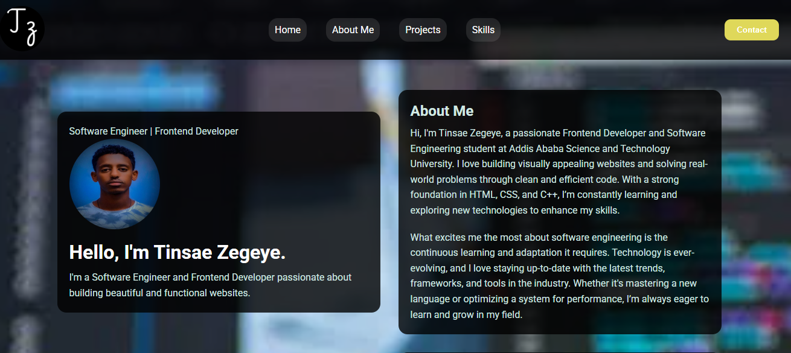

# Tinsae Zegeye - Portfolio Website 🌐

A modern and responsive portfolio website showcasing projects, skills, and professional information.

## Features ✨

- **Responsive Design**: Works flawlessly on all devices
- **Interactive Elements**:
  - Animated skill progress bars
  - Smooth scroll navigation
  - Hover effects on cards
- **Contact Modal**:
  - Form validation
  - Direct email integration
- **Performance Optimized**:
  - Lazy-loaded images
  - CSS animations
- **Modern Styling**:
  - Glassmorphism effects
  - Custom color scheme
  - Responsive grid layout
